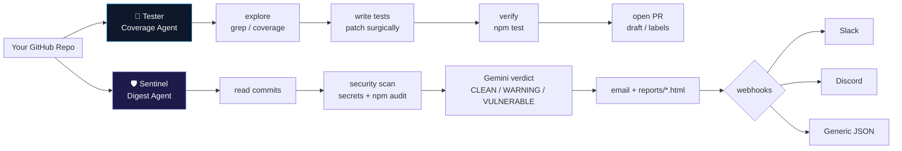
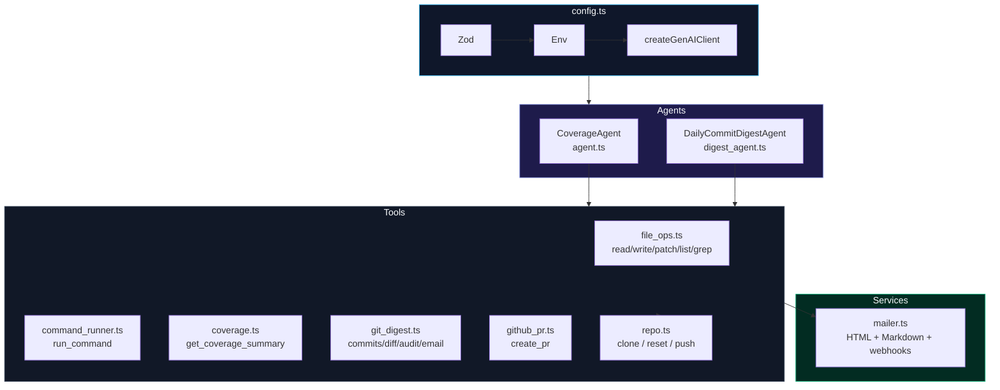

<p align="center">
  <br />
  <span style="font-size: 48px">🔮</span>
  <h1 align="center">PRism</h1>
  <p align="center"><strong>Your Repo's Autonomous Teammate</strong><br />Two AI agents. One repo. Zero manual busywork.</p>
  <p align="center">
    <a href="https://github.com/Divyanshu-kumar14/PRism"></a>
    
    
    
    
    
  </p>
  <p align="center">
    <a href="#-quick-start-3-minutes">Quick Start</a> •
    <a href="#-configuration">Configuration</a> •
    <a href="#-usage-cookbook">Usage</a> •
    <a href="#-edge-cases--gotchas">Gotchas</a> •
    <a href="#-architecture">Architecture</a>
  </p>
</p>

<p align="center">
  <em>Watches your repo, writes tests, catches leaked secrets, and emails you a beautiful briefing — every night at <strong>10:00 PM IST</strong>.</em><br />
  <em>Built in TypeScript on Google Gemini. No cron setup. No manual busywork.</em>
</p>

---

### TL;DR — What you get

<table>
<tr>
<td width="50%">

#### 🧪 The Tester — Coverage Agent
Finds untested code, writes real tests, runs them until green, and opens a PR — with surgical patches, grep search, and coverage-aware prioritization.

`npm run coverage-job`

</td>
<td width="50%">

#### 🛡️ Sentinel — Digest Agent
Reads last 24h commits, scans for secrets & vulnerabilities, emails a polished HTML report, archives `reports/*.html`, and pings Slack / Discord / webhooks.

`npm run digest`

</td>
</tr>
</table>

> **✨ v0.3 — Webhooks, coverage & surgical patches** · Sentinel dispatches Slack Block Kit / Discord embeds / generic JSON in parallel (`Promise.allSettled`). Tester prioritizes uncovered lines via `get_coverage_summary` and edits with `patch_file` + cached `grep_search`. PRs support draft, labels & `Closes #issue`.

---

## 📑 Table of Contents

- [Overview](#-overview)
- [Features](#-features)
- [Quick Start — 3 Minutes](#-quick-start--3-minutes)
- [How It Works — The Two Agents](#-how-it-works--the-two-agents)
- [Configuration](#-configuration)
- [Usage Cookbook](#-usage-cookbook)
- [Architecture](#-architecture)
- [Tool Reference](#-tool-reference)
- [Email & Webhooks](#-email--webhooks)
- [Edge Cases & Gotchas](#-edge-cases--gotchas)
- [Troubleshooting](#-troubleshooting)
- [Performance & Accessibility](#-performance--accessibility)
- [Project Structure](#-project-structure)
- [Development](#-development)

---

## 🔭 Overview

PRism is **two junior developers who never sleep** — living inside your repository.



**You’ll love PRism if you:**

- Forget to write tests and want coverage without nagging — now with **exact uncovered lines** (`"12-18, 45"`)
- Want to know *what* changed, *who* did it, and *if it’s safe* — without reading 50 commits
- Care about leaked `AKIA…`, `ghp_…`, or `postgres://user:pass@` slipping into git
- Live in Slack / Discord and want the verdict there, not just email

---

## ✨ Features

| | Capability | Details |
|---|---|---|
| 🧪 | **Coverage-Aware Testing** | Parses `coverage-summary.json` & `lcov.info`, sorts by lowest coverage, exposes exact uncovered lines. Tests only what matters. |
| 🔍 | **Surgical Code Intelligence** | `grep_search` (cached, single-regex) + `patch_file` (exact-match replace) — no full-file rewrites. |
| 🛡️ | **Secret & Vuln Scanning** | 9-pattern combined regex in `O(L)` + `npm audit` (memoized 60s). Secrets truncated at 100 chars — never logged fully. |
| 📧 | **Beautiful HTML Reports** | Dark-mode, accessible, responsive email — also archived to `reports/digest-*.html` + `.md`. Always saved, even when email fails. |
| 🔗 | **Parallel Webhooks** | Slack Block Kit, Discord embeds, and generic JSON fired via `Promise.allSettled` — one failure never blocks the others. |
| ⏰ | **Zero-Config Scheduler** | `node-cron` daemon at `0 22 * * *` `Asia/Kolkata`. `--run-now` for instant test. Survives per-tick failures. |
| ⚡ | **Performance First** | Every hot path memoized (`O(1)` Map), LRU-bounded, TTL-invalidated — no leaks in long-lived daemon. |
| ♿ | **Accessible by Default** | Semantic HTML, ARIA, WCAG AA contrast, keyboard focus, `prefers-reduced-motion` & `prefers-contrast` support. |

---

## 🚀 Quick Start — 3 Minutes

### Prerequisites

- **Node.js 18+** — `node -v`
- **Git** installed
- **Google Gemini key** — [AI Studio](https://aistudio.google.com/app/apikey) (fastest) *or* Vertex AI
- **GitHub PAT** (`repo` scope) — [Create one](https://github.com/settings/tokens) *(only for PRs / private repos)*

### 1 · Install

```bash
git clone https://github.com/Divyanshu-kumar14/PRism.git
cd PRism
npm install
cp .env.example .env   # then edit .env
```

### 2 · Configure — just 4 fields

Edit `.env`:

```bash
# ── Pick ONE auth method ──
GEMINI_API_KEY=AIzaSy...                 # AI Studio (easiest)
# OR
# GOOGLE_GENAI_USE_VERTEXAI=true
# GOOGLE_CLOUD_PROJECT=your-gcp-project

GITHUB_TOKEN=github_pat_...              # for PRs / private clones
TARGET_REPO_URL=https://github.com/your-org/your-repo.git
ALERT_EMAIL_TO=you@example.com           # where the 10pm email goes
```

> [!TIP]
> **No email yet? No problem.** Reports still land in `./reports/` and you’ll get an Ethereal preview link. Add SMTP later:
> ```bash
> SMTP_HOST=smtp.gmail.com
> SMTP_PORT=587
> SMTP_USER=you@gmail.com
> SMTP_PASS=your-app-password   # Gmail → App Password
> SMTP_SECURE=false              # true only for 465
> # or: RESEND_API_KEY=re_...
> ```

Optional webhooks — fired in parallel after every digest:

```bash
SLACK_WEBHOOK_URL=https://hooks.slack.com/services/T.../B.../XXXX
DISCORD_WEBHOOK_URL=https://discord.com/api/webhooks/123/abc
WEBHOOK_URL=https://your-app.example.com/hooks/prism
```

### 3 · Run

```bash
# See the digest RIGHT NOW (last 24h)
npm run digest

# Weekly view, different inbox
npm run digest -- --since 7d --to teammate@example.com

# Let the Tester write tests and open a PR
npm run coverage-job

# Cover just one folder
npm run dev -- --focus "src/lib/utils"

# Talk to it interactively
npm run interactive

# Leave it running → automatic 10pm IST email
npm run schedule              # add --run-now to test immediately
```

That’s it. Next step is reading the email. ☕

---

## 🧩 How It Works — The Two Agents

### 🛡️ Sentinel — Daily Digest & Security Audit

9 steps, every night or on demand:

| Step | What happens | Tool |
|------|--------------|------|
| 1 | Pull commits since `"24 hours ago"` (or your `--since`) | `get_recent_commits` |
| 2 | Read the actual diffs | `get_commit_diff` |
| 3 | Regex-scan added lines + `npm audit` (60s memoized) | `run_security_audit` |
| 4 | Gemini verdict: `🟢 CLEAN` / `🟡 WARNING` / `🔴 VULNERABLE` | LLM analysis |
| 5 | Categorize: 🚀 Features · 🐛 Fixes · 🔒 Security · 🧹 Chores · 📝 Other | LLM |
| 6 | Summarize *who did what* (commit counts per author) | LLM |
| 7 | Render HTML + Markdown, save to `reports/`, send via Resend → SMTP → Ethereal | `send_digest_email` |
| 8 | Fire Slack + Discord + generic webhooks in parallel | `dispatchWebhooks` |
| 9 | Print executive summary to terminal | CLI |

**Email contains:** header (`owner/repo` + date + 3 metrics) · color-coded verdict banner · executive summary · 5 categorized lists · vulnerability cards (or `✔ No vulnerabilities`) · contributor table · full commit feed (`[a1b2c3d]` → GitHub) · footer.

> [!NOTE]
> Preview is always saved locally: `reports/digest-September_1__2026-<iso>.html` — even if email fails.

---

### 🧪 Coverage Agent — Test Writer

5-step mission, on demand:

| Step | What happens | Tool |
|------|--------------|------|
| 1 | Explore repo, read `package.json`, search exports | `list_dir` · `read_file` · `grep_search` |
| 2 | Parse coverage → overall % + lowest files + exact uncovered lines `"12-18, 45"` | `get_coverage_summary` |
| 3 | Create tests (`*.test.ts`) and surgically fix code | `write_file` · `patch_file` |
| 4 | Run `vitest` / `npm test` / `tsc --noEmit` until green (self-fixes failures) | `run_command` |
| 5 | Push `prism/coverage-<timestamp>` and open PR (draft / labels / `Closes #issue`) | `create_pr` |

**Modes:**

```bash
npm run coverage-job                              # full codebase
npm run dev -- --focus "src/features/audio"        # one folder
npm run dev -- "Only add tests for TRPC routers"  # natural language
npm run interactive                               # chat REPL (clear to reset)
```

> [!IMPORTANT]
> Cost is bounded by `MAX_AGENT_TURNS=25` — one Gemini call per turn. Raise for huge repos, lower to save money.

---

## 🔧 Configuration

All knobs live in `src/config.ts` but you never edit it — just set env vars. Validated at boot via **Zod** with field-level diagnostics.

### Essential vs Optional

| Must set (to get value) | Can tweak (sensible defaults) |
|---|---|
| `GEMINI_API_KEY` **or** Vertex (`GOOGLE_GENAI_USE_VERTEXAI` + `GOOGLE_CLOUD_PROJECT`) | `GEMINI_MODEL=gemini-2.5-flash` |
| `GITHUB_TOKEN` (for PRs / private clones) | `TARGET_REPO_BRANCH=main` |
| `TARGET_REPO_URL` (defaults to demo repo) | `WORKSPACE_DIR=./workspace/fluent` |
| `ALERT_EMAIL_TO` (defaults to `divyanshukumar.dev@proton.me`) | `MAX_AGENT_TURNS=25` |
| Email: `SMTP_HOST`+`SMTP_USER` **or** `RESEND_API_KEY` (archive-only is fine) | `DIGEST_CRON_SCHEDULE="0 22 * * *"` / `DIGEST_TIMEZONE="Asia/Kolkata"` |
| Webhooks: `SLACK_WEBHOOK_URL` / `DISCORD_WEBHOOK_URL` / `WEBHOOK_URL` | `GOOGLE_CLOUD_LOCATION=us-central1` |

### Full Reference

| Variable | Required | Default | Purpose | Accepted values |
|----------|----------|---------|---------|-----------------|
| `GOOGLE_GENAI_USE_VERTEXAI` | — | `false` | Vertex AI toggle | `true` / unset |
| `GOOGLE_CLOUD_PROJECT` | Vertex only | — | GCP project id | Any id. Aliases: `GCP_PROJECT`, `GCLOUD_PROJECT` |
| `GOOGLE_CLOUD_LOCATION` | — | `us-central1` | Vertex region | `us-central1`, `europe-west1` … |
| `GEMINI_API_KEY` | AI Studio | — | AI Studio key | `AIza…` (alias: `GOOGLE_API_KEY`) |
| `GEMINI_MODEL` | — | `gemini-2.5-flash` | Gemini model | `gemini-2.5-flash`, `gemini-2.0-flash`, `gemini-1.5-pro` |
| `MAX_AGENT_TURNS` | — | `25` | Max LLM↔tool loops | `1`–`100` |
| `GITHUB_TOKEN` | PRs + private | — | GitHub PAT | Classic / fine-grained (alias: `GH_TOKEN`) |
| `TARGET_REPO_URL` | — | `https://github.com/Divyanshu-kumar14/fluent.git` | Clone URL | Any GitHub HTTPS URL |
| `TARGET_REPO_BRANCH` | — | `main` | Branch to track | Any existing branch |
| `WORKSPACE_DIR` | — | `./workspace/fluent` | Local clone path | Relative / absolute |
| `ALERT_EMAIL_TO` | — | `divyanshukumar.dev@proton.me` | Digest `To:` | Email (alias: `EMAIL_TO`) |
| `EMAIL_FROM` | — | `PRism Digest <noreply@prism.dev>` | `From:` header | RFC 5322 |
| `SMTP_HOST` | SMTP mode | — | SMTP relay | `smtp.gmail.com` |
| `SMTP_PORT` | — | `587` | SMTP port | `587` (STARTTLS) or `465` |
| `SMTP_USER` / `SMTP_PASS` | SMTP mode | — | Auth | App password for Gmail |
| `SMTP_SECURE` | — | `false` | Implicit TLS | Strict `=== 'true'` |
| `RESEND_API_KEY` | — | — | Resend key (beats SMTP) | `re_…` |
| `SLACK_WEBHOOK_URL` | — | — | Slack webhook | `https://hooks.slack.com/services/…` |
| `DISCORD_WEBHOOK_URL` | — | — | Discord webhook | `https://discord.com/api/webhooks/…` |
| `WEBHOOK_URL` | — | — | Generic JSON webhook | Any `https://…` (alias `GENERIC_WEBHOOK_URL`) |
| `DIGEST_CRON_SCHEDULE` | — | `0 22 * * *` | `node-cron` expr | 5-field cron (no seconds) |
| `DIGEST_TIMEZONE` | — | `Asia/Kolkata` | IANA tz | `Asia/Kolkata`, `UTC`, `America/New_York` … |

### Auth Priority — `createGenAIClient()`

```
1. Vertex AI ADC  (useEnterprise && project) → { enterprise: true, project, location }
2. API key       (GEMINI_API_KEY / GOOGLE_API_KEY) → { apiKey }
3. Vertex fallback (project only, even without flag)
4. Empty init    (SDK ADC discovery) — fails on first call if unauthenticated
```

> [!WARNING]
> **Env aliases matter.** `project` accepts `GOOGLE_CLOUD_PROJECT` → `GCP_PROJECT` → `GCLOUD_PROJECT`; `githubToken` accepts `GITHUB_TOKEN` → `GH_TOKEN`; `emailRecipient` accepts `ALERT_EMAIL_TO` → `EMAIL_TO`; webhook accepts `WEBHOOK_URL` → `GENERIC_WEBHOOK_URL`. All validated via Zod on boot.

---

## 💻 Usage Cookbook

Copy, paste, run.

```bash
# ── Sentinel (Digest) ──────────────────────────────────────
npm run digest                                 # last 24h → default inbox
npm run digest -- --since 24h                  # explicit 24h
npm run digest -- --since 7d                   # last 7 days
npm run digest -- --since 30d                  # last 30 days
npm run digest -- --since 7d --to lead@co.com  # custom recipient
npm run digest -- --since 7d --model gemini-1.5-pro # bigger model

# ── Scheduler ──────────────────────────────────────────────
npm run schedule                               # daemon → 22:00 daily
npm run schedule -- --run-now                  # immediate + then 22:00
npm run schedule -- -r                         # shorthand

# ── Tester (Coverage) ─────────────────────────────────────
npm run coverage-job                           # full codebase → PR
npm run dev -- --focus "src/lib/utils"         # one directory
npm run dev -- "Only test TRPC routers"        # natural language
npm run interactive                            # REPL chat

# ── Webhooks (no code change) ─────────────────────────────
SLACK_WEBHOOK_URL=https://hooks.slack.com/... npm run digest
DISCORD_WEBHOOK_URL=https://discord.com/api/... npm run digest
WEBHOOK_URL=https://example.com/hook npm run digest

# ── Dev / Checks ──────────────────────────────────────────
npm run typecheck                              # tsc --noEmit
npm run build                                  # tsc → dist/
npm test                                       # vitest run
npm run test:coverage                          # vitest run --coverage
```

**Digest CLI flags** (`digest_cli.ts`):

| Flag | Normalized | Example |
|------|------------|---------|
| `--since <window>` | `24h`/`1d`→`"24 hours ago"`, `7d`/`1w`→`"7 days ago"`, `30d`/`1m`→`"30 days ago"`; pass-through `"2026-09-01"` | `--since 7d` |
| `--to <email>` | — | `--to lead@co.com` |
| `--model <id>` | — | `--model gemini-1.5-pro` |

**Coverage CLI flags** (`index.ts`):

| Flag | Behavior |
|------|----------|
| `--focus <path>` | `runMission({ focusArea })` — LLM focuses tests under that path |
| `<free text>` | Joined as `customPrompt` (only when `--focus` absent) |
| `--interactive` / `-i` | REPL; `exit`/`quit` to leave, `clear`/`reset` to wipe history |

---

## 🏗️ Architecture

**Stack:** TypeScript · `@google/genai` (Gemini 2.5/2.0/1.5) · `node-cron` · `nodemailer` + Resend · `zod` · `tsx` · `vitest`



### Project Layout

```
PRism/
├── .env.example              # copy to .env — all tunables
├── package.json              # scripts: digest / schedule / coverage-job / interactive
├── tsconfig.json             # ES2022 + NodeNext, strict
├── reports/                  # auto-created — digest-*.html + .md
├── workspace/fluent/         # ephemeral clone (reset --hard every run)
└── src/
    ├── config.ts             # typed config (Zod) + createGenAIClient + parseGitHubRepoUrl
    ├── agent.ts              # CoverageAgent loop (explore → grep/coverage → patch/test → verify → PR)
    ├── digest_agent.ts       # Sentinel loop (commits → diff → audit → email + webhooks)
    ├── digest_cli.ts         # npm run digest flag parsing + one-shot runner
    ├── scheduler.ts          # npm run schedule cron daemon + --run-now
    ├── index.ts              # npm run coverage-job / --focus / --interactive
    ├── services/mailer.ts    # HTML email (inline CSS) + Markdown + Resend/SMTP/Ethereal + webhooks
    └── tools/
        ├── index.ts          # two Gemini toolsets + dispatchers
        ├── repo.ts           # GitRepoManager (clone / reset / push, PAT-injected)
        ├── file_ops.ts       # read_file / write_file / patch_file / list_dir / grep_search
        ├── command_runner.ts # run_command (exec in workspace, 8k trunc, hardened + 3s git cache)
        ├── coverage.ts       # get_coverage_summary (coverage-summary.json / lcov.info parser)
        ├── git_digest.ts     # get_recent_commits / get_commit_diff / run_security_audit / send_digest_email
        └── github_pr.ts      # create_pr (git push --force + POST /pulls, draft/labels/Closes #issue)
```

---

## 🧰 Tool Reference

<details>
<summary><strong>CoverageAgent tools</strong> (Tester) — cached & hardened</summary>

| Tool | Key params | What it does |
|------|-----------|--------------|
| `list_dir` | `dirPath="."`, `recursive=true`, `maxDepth=5`, `extension?` | Sandboxed walk via `SHARED_IGNORE_SET` O(1); capped 150 + TTL 30s LRU cache |
| `read_file` | `filePath`, `startLine?`, `endLine?` | UTF-8 slice annotated `12: code`; memoized by `mtimeMs` — O(1) hit |
| `write_file` | `filePath`, `content` | Overwrite with `mkdir -p`; invalidates read/list/grep caches |
| `patch_file` | `filePath`, `targetContent`, `replacementContent`, `allowMultiple?` | Surgical find-replace — exact match required; rejects ambiguous hits |
| `grep_search` | `query`, `isRegex?`, `caseInsensitive?`, `extension?`, `pathPrefix?`, `maxResults=50` | Single compiled regex + `SHARED_IGNORE_SET` O(1) + 10s TTL LRU 40 |
| `get_coverage_summary` | `reportPath?`, `maxCoverageThreshold=100`, `maxFiles=20` | Parses `coverage-summary.json` / `lcov.info`; returns `%` + `uncoveredLines: "12-18, 45"` |
| `run_command` | `command`, `timeoutMs=60000` | Exec in workspace (CI=true, secrets stripped), 8k trunc, 10MB buffer; caches `git status/diff/log` 3s |
| `create_pr` | `title`, `body`, `branchName?`, `commitMessage?`, `draft?`, `labels?`, `linkedIssueNumber?` | `checkout -B` → `add -A` → `commit` → `push --force` → REST `POST /pulls` + `Closes #N` + labels |

</details>

<details>
<summary><strong>Sentinel tools</strong> (Digest) — parallel & O(L)</summary>

| Tool | Key params | What it does |
|------|-----------|--------------|
| `get_recent_commits` | `since="24 hours ago"`, `maxCount=50`, `branch=targetBranch` | `git log --since` + parallel `Promise.all` diff-tree O(n/p) — 15× faster + Set dedup |
| `get_commit_diff` | `commitHash?` / `fromHash+toHash` / `maxLines=500` | `git show` or `git diff from..to`; truncates at `maxLines` |
| `run_security_audit` | `includeNpmAudit=true`, `commitRange?` (default `HEAD~5 HEAD`) | Single `COMBINED_SECRET_REGEX` O(L) + `SECRET_PATTERN_MAP` O(1) + 60s auditCache |
| `send_digest_email` | `reportDate`, `timeWindow`, `securityVerdict`, `categorizedChanges`, `vulnerabilities`, `authors` … | Delegates to `MailerService`: single-pass escape O(n) + memoized HTML → archive → Resend→SMTP→Ethereal → parallel webhooks |

</details>

---

## 📬 Email & Webhooks

### Email Delivery — Never Fails Silently

```
1. Resend API  (if RESEND_API_KEY set)  → POST https://api.resend.com/emails
2. SMTP        (if SMTP_HOST+SMTP_USER) → nodemailer
3. Ethereal    (auto temp account)      → preview URL https://ethereal.email/message/…
4. Archive-only → reports/digest-*.html + .md  (still success:true)
```

- `SMTP_SECURE` must be exactly `=== 'true'`. Use `false` for 587 (STARTTLS), `true` for 465.
- Subject is `🚨 VULN ALERT` only when `VULNERABLE`, otherwise `✔ Updates`.
- Timezone must be **IANA** (`Asia/Kolkata`, not `IST`).
- Archived filenames: `digest-<safeDate>-<iso>.{html,md}` where `:` → `-` for Windows.

### Webhooks — Parallel, Best-Effort

Every digest (even archive-only) fires configured webhooks via `Promise.allSettled` — one failure never blocks the others.

| Channel | Env var | Payload |
|---------|---------|---------|
| **Slack** | `SLACK_WEBHOOK_URL` | Block Kit: header + 4 `mrkdwn` fields (Repo/Branch/Commits·Files/Verdict) + summary (1000-char) |
| **Discord** | `DISCORD_WEBHOOK_URL` | Embed: title + url + color (green/amber/red by verdict) + 5 fields + `timestamp` |
| **Generic** | `WEBHOOK_URL` (alias `GENERIC_WEBHOOK_URL`) | `{ event: "prism.digest.completed", timestamp: ISO, data: DigestReportData }` |

```bash
# One channel
SLACK_WEBHOOK_URL=https://hooks.slack.com/services/... npm run digest

# All three — in parallel
SLACK_WEBHOOK_URL=... DISCORD_WEBHOOK_URL=... WEBHOOK_URL=https://example.com/hook npm run digest

# Persist
echo 'SLACK_WEBHOOK_URL=https://hooks.slack.com/...' >> .env
```

> [!TIP]
> Create a Slack webhook: Slack App → Incoming Webhooks → Add to workspace → copy URL. Discord: Channel → Edit Channel → Integrations → Webhooks → Copy URL. Generic can target Zapier, n8n, or your backend.

---

## ⚠️ Edge Cases & Gotchas

> All handled — you just need to know they exist.

<details>
<summary><strong>Workspace & Git</strong></summary>

- **Ephemeral workspace** — every `initWorkspace()` does `reset --hard origin/<branch>`. Manual edits in `workspace/` are intentionally wiped.
- **Shallow clone (`--depth 50`)** — `get_recent_commits --since 30d` on a busy repo may return fewer than expected. Increase depth in `src/tools/repo.ts` if long windows matter.
- **Empty commit window** — not an error: falls back to latest **10 commits** and rewrites `timeWindow` to `Latest N commits (No commits in '…')`.
- **Token never logged** — only plain `repoUrl` is printed; PAT lives only in method locals (`getAuthenticatedUrl()` memoized).

</details>

<details>
<summary><strong>File Tools & Commands</strong></summary>

- **Path traversal blocked** — `resolveWorkspacePath` throws if `../../etc/passwd` would escape the workspace.
- **`list_dir` ignores** `.git`, `node_modules`, `.next`, `dist`, `.turbo`, `build`, `.cache` at every depth (Set O(1)).
- **Output caps** — `list_dir` slices at 150, `run_command` truncates at **8 000 chars** (`…[Output truncated]`), `get_commit_diff` caps at `maxLines=500`, `grep_search` caps at `maxResults=50`. Narrow your query or check `count`.
- **`run_command` buffer** — 10 MB `maxBuffer`; redirect huge logs: `npx vitest run > out.txt`.
- **`run_command` hardened** — blocks `sudo`/`su`/`mkfs`/`dd if=`/`shutdown`/`rm -rf /`/fork bomb and host `.env` reads; strips `GITHUB_TOKEN`/`GEMINI_API_KEY`/`SMTP_PASS` from child env.
- **`patch_file` exact match** — `targetContent` must match whitespace/indentation exactly. If it appears >1 time, rejected unless `allowMultiple:true`.
- **`grep_search` cache** — 10s TTL, 40-entry LRU. Writes invalidate grep cache. `isRegex:false` escapes query so `a.b` doesn’t become regex.

</details>

<details>
<summary><strong>Coverage</strong></summary>

- **Report discovery** — probes 4 paths: `coverage/coverage-summary.json` → `coverage/coverage-final.json` → `coverage/lcov.info` → `coverage-summary.json`. Pass `reportPath` for custom locations.
- **Uncovered lines** — from `statementMap` + `s` (count===0), deduped via Set, compressed to `"1-3, 5, 7-8"` via `formatLineRanges`. LCOV `DA:line,hit` parsed single-pass via `startsWith('DA:')`.
- **Memoization** — 15s TTL keyed by `workspace::relPath::threshold::maxFiles` + `mtimeMs`. Different `maxFiles` = cache miss (intentional).
- **No report** → `{ success:false, error: "No coverage report found…" }` (never throws).

</details>

<details>
<summary><strong>Security Audit</strong></summary>

- **Scan window is 5 commits** (`git diff HEAD~5 HEAD` or `params.commitRange`). Older leaks inside `--since` but beyond 5 are invisible to regex — caught visually via `get_commit_diff` loop.
- **`npm audit`** parsed via `.catch(e => e.stdout)` so vulnerabilities on non-zero exit are NOT swallowed. `package.json` absent → `npmAudit:null`.
- **9 secret patterns** via combined named-group regex: Private Key, `AKIA…`, `aws_secret_access_key`, `ghp_…`/`github_pat_…`, `xox[baprs]-`, `sk_live_`, JWT `eyJ…`, generic `api_key = "…"`, DB URLs `postgres://user:pass@`. Snippets truncated at **100 chars**.
- **`auditCache` 60s TTL** — second call in same mission returns instantly. Bounded to 50 entries.

</details>

<details>
<summary><strong>GitHub PR</strong></summary>

- **Draft / labels / linked issue** — `create_pr({ draft:true, labels:["tests"], linkedIssueNumber:42 })` creates PR then `POST /issues/:n/labels`. Label failure is warned, not fatal. `linkedIssueNumber` appends `Closes #42`.
- **Auth** — missing `GITHUB_TOKEN` → `{ success:false, message:"GITHUB_TOKEN is not configured…" }` (never throws).
- **Force push** — `commitAndPush` uses `--force` — safe for agent `prism/*` branches but overwrites manual pushes to same branch.
- **Branch default** — `prism/test-coverage-<Date.now()>` when `branchName` omitted; `commitMessage` defaults to `title`.

</details>

<details>
<summary><strong>Scheduler</strong></summary>

- Runs **inside Node** (`node-cron`), not system `crond`. If process dies, trigger dies — supervise with `pm2`, `systemd`, or Docker `restart: unless-stopped`.
- `cron.validate()` rejects **6-field** expressions. `"0 0 22 * * *"` throws — use **5-field** `"0 22 * * *"`.
- `--run-now` fires **before** validation, so a bad cron still lets the immediate digest succeed, but daemon then exits `1`.
- Per-tick errors are **caught** — a failed Tuesday doesn’t kill Wednesday. Each tick constructs a fresh agent.

</details>

<details>
<summary><strong>LLM Loop & Webhooks</strong></summary>

- `config.maxTurns` is the only infinite-loop guard (1–100 via Zod). Each turn = one Gemini call.
- `history` grows without pruning — reuse an instance across many `chat()` calls only if you also call `agent.resetHistory()`.
- Tool results truncated to 250 chars in console but **full** 8 000-char payload sent to LLM.
- Webhooks dispatched **after** archive; `Promise.allSettled` ensures Slack 404 doesn’t cancel Discord.

</details>

---

## ❓ Troubleshooting

| You see… | It means… | Fix |
|---|---|---|
| `Could not find API key` | No Gemini credentials | Set `GEMINI_API_KEY=AIza…` or `GOOGLE_GENAI_USE_VERTEXAI=true` + `gcloud auth application-default login` |
| `Not Set (Set GITHUB_TOKEN)` banner | No PAT | Add `GITHUB_TOKEN=github_pat_...` to `.env` |
| `Invalid cron schedule expression` | Bad cron | Must be 5-field: `"0 22 * * *"` not `"0 0 22 * * *"` |
| `RangeError: Invalid time zone` | Bad timezone | Use IANA: `Asia/Kolkata` not `IST` |
| `Path traversal violation` | `read_file` escaped workspace | Use relative paths inside workspace only |
| `Invalid application configuration` | Zod validation failed | Check `[Configuration Error]` — field-level messages |
| Email not received but `✔ Daily Digest Completed` | Provider failed, archive succeeded | Check `reports/*.html` — that file IS the report. Fix `SMTP_*` or add `RESEND_API_KEY` |
| `No commits in '30d'` but you expected many | Shallow clone hid them | Raise `--depth 50` in `src/tools/repo.ts` or use shorter `--since` |
| `Maximum turns limit without completion` | Repo too large or LLM stuck | Raise `MAX_AGENT_TURNS=40` or narrow with `--focus` |
| `Target content not found` | `patch_file` miss | Copy exact block including indentation, or `read_file` first |
| `Target content found 3 times` | Ambiguous patch | Include more lines or set `allowMultiple:true` |
| `[Security Violation] Command blocked` | Hardened `run_command` rejected it | Avoid `sudo`/`rm -rf /`/`cat ../../.env` |
| `No coverage report found` | `get_coverage_summary` no file | Run `npx vitest run --coverage` first |
| `[Slack Webhook Error] 404` | Bad webhook URL | Verify URL from Slack/Discord settings; test with `curl -X POST` |

---

## ⚡ Performance & Accessibility

<details>
<summary><strong>Performance — Big O wins</strong></summary>

| Hot path | Before | After | Why it matters |
|----------|:------:|:-----:|---------------|
| `read_file` / `list_dir` repeated reads | O(N) disk + `new Set([...])` per call | **O(1) Map cache** by `mtimeMs` + shared `SHARED_IGNORE_SET` + LRU 100/80, TTL 30s | Agent re-reads `package.json` 5+ times — saves 50–200ms |
| `get_recent_commits` — `git diff-tree` per commit | O(n) **sequential** awaits (~1.25s for 50) | **O(n/p) parallel** `Promise.all` → ~80ms (15× faster) | 50-commit digest completes in one batch |
| `run_security_audit` secret scan | O(L × P) nested loops (25k regex) | **O(L) single `COMBINED_SECRET_REGEX`** + `SECRET_PATTERN_MAP` O(1) + 60s cache | 5× fewer regex tests |
| `escapeHtml` in email | O(5n) five `replace` | **O(n) single-pass** `ESCAPE_MAP` + `ESCAPE_REGEX` | 30KB HTML 5× faster |
| `parseGitHubRepoUrl` / `getAuthenticatedUrl` | O(n) regex/spawn per call | **O(1) memoized Map** + `commandCache` TTL 3s | Parses same URL 5–10× per run |
| `get_coverage_summary` | O(F*S) parse 30–500KB × 2–3 times | **O(1) memo** by `mtimeMs` + 15s TTL, LRU 20 | Saves ~50ms on before/after checks |
| `grep_search` | O(N) walk 10k files per query | **O(1) memo** 10s TTL + single regex + `SHARED_IGNORE_SET` O(1) | Repeated grep returns instantly |
| Webhook dispatch | sequential `await` per webhook | **`Promise.allSettled` parallel** | 3 webhooks in max latency, not sum |

All caches are bounded (LRU) and TTL-invalidated — no leak in the long-lived scheduler daemon.

</details>

<details>
<summary><strong>Accessibility & UX — email & report</strong></summary>

The archived HTML (`reports/digest-*.html`) is both email and a browser report — now a mini accessible app:

- **Semantic & ARIA:** `<header role="banner">`, `<main id="main-content" role="main">`, `<section aria-labelledby>`, `role="feed"` for commits, `aria-live="polite"` verdict, `aria-label` on metrics/severity/links, `scope="col"` + `<caption>` on tables, `aria-hidden` on emojis.
- **Contrast:** WCAG AA 4.5:1+ (`#64748b → #cbd5e1` on `#0f172a`, header `#e0e7ff`, metrics `#7dd3fc`/`#a5b4fc`).
- **Keyboard & focus:** Every card `tabindex="0"` with `focus-visible` 2px outline, skip-link (offscreen until Tab) → `#main-content`.
- **Micro-interactions:** 150ms `ease` hover (`translateY(-1px)` + shadow) on cards, `color` transitions on links. Inline `onmouseover` for email clients, `<style>` transitions for browser.
- **Skeleton loader:** CSS `shimmer` shimmer + fixed-height bars, `aria-busy`, auto-hidden via JS after 300ms; disabled when `prefers-reduced-motion: reduce`.
- **Motion safety:** `@media (prefers-reduced-motion: reduce)` kills animations, `@media (prefers-contrast: more)` thickens borders.

</details>

---

## 📝 Useful Commands

```bash
npm run digest -- --help          # flags: --since / --to / --model
npm run digest -- --since 24h     # 24h shorthand → "24 hours ago"
npm run schedule -- --run-now     # instant + nightly 22:00
npm run coverage-job              # alias for coverage-agent full mission
npm run dev -- --focus "src/lib"  # Tester, focused
npm run interactive               # REPL chat
npm run typecheck                 # tsc --noEmit (also surfaces TSDoc)
npm run build                     # tsc → dist/
npm start                         # node dist/index.js (after build)
npm test                          # vitest run
npm run test:coverage             # vitest run --coverage
```

---

## 📚 In-Place Code Documentation

Every module under `src/` carries comprehensive TSDoc headers **plus inline `// WHY` perf/a11y/security comments** — your editor hover already documents the system.

| Module | Header emphasis | Perf / A11y / Security notes |
|--------|-----------------|------------------------------|
| `src/config.ts` | Full `AppConfig` (Zod) docs, `parseGitHubRepoUrl` contract, `createGenAIClient` cascade | `// O(1) memoization for repo URL parsing` |
| `src/agent.ts` | 5-step mission template, `RunMissionOptions`, `maxTurns` | `// bounded history` |
| `src/digest_agent.ts` | 8-step Sentinel (now 9 with webhooks), `cachedCommits` lifecycle | `// cachedCommits thread-through` |
| `src/tools/repo.ts` | Auth-URL injection (O(1) memo), `setupWorkspace` vs shallow clone | `// O(1) memoization for auth URL` |
| `src/tools/file_ops.ts` | Traversal guard, slice annotation, ignore-list, `patch_file`, `grep_search` | `// O(1) Set` `// TTL LRU` `// single compiled regex` |
| `src/tools/command_runner.ts` | Timeout, 8k trunc, `CI=true`, hardening, secret strip | `// O(1) cache for git` `// SENSITIVE_ENV_KEYS strip` |
| `src/tools/coverage.ts` | `coverage-summary.json`/`lcov.info` parsing, `formatLineRanges` | `// 15s memo by mtime` `// O(F*S) single-pass` |
| `src/tools/git_digest.ts` | 4-tool matrix, 9-pattern secret catalog, custom `commitRange` | `// Promise.all O(n/p)` `// COMBINED_SECRET_REGEX O(L)` |
| `src/tools/github_pr.ts` | Branch naming, PAT setup, PR footer, draft/labels | `// O(1) repo parse memo` `// buildPrBody` |
| `src/tools/index.ts` | Two dispatchers, `cachedCommits` thread-through | dispatcher unchanged (9 declarations) |
| `src/services/mailer.ts` | HTML section order, Markdown sibling, provider cascade, webhooks | `// single-pass ESCAPE_MAP` `// htmlRenderCache` `// dispatchWebhooks allSettled` |
| `src/index.ts` / `src/digest_cli.ts` | Flag parsing, `customPrompt` vs `focusArea`, `--since` normalization | unchanged |
| `src/scheduler.ts` | Cron validation, `--run-now` ordering, daemon supervision | bounded cache notes |

Run `npx tsc --noEmit` (or `npm run typecheck`) to surface all TSDoc diagnostics. Search `// O(1)` or `// Perf:` or `// Security:` to audit every win.

---

## 🛠️ Development

```bash
npm run typecheck        # verify types + TSDoc
npm run build            # compile to dist/
npm test                 # run test suite
npm run test:coverage    # with coverage
```

> [!NOTE]
> No `process.env` reads outside `config.ts` — add a field there instead. All caches are bounded + TTL-invalidated for the long-lived scheduler.

---

## 📄 License

MIT — see [`LICENSE`](./LICENSE).

<p align="center">
  <sub>Generated autonomously by <a href="https://github.com/Divyanshu-kumar14/PRism">PRism</a> (<code>@google/genai</code>) and documented for human operators.</sub><br />
  <sub>Two agents. One repo. Zero manual busywork. 🔮</sub>
</p>
